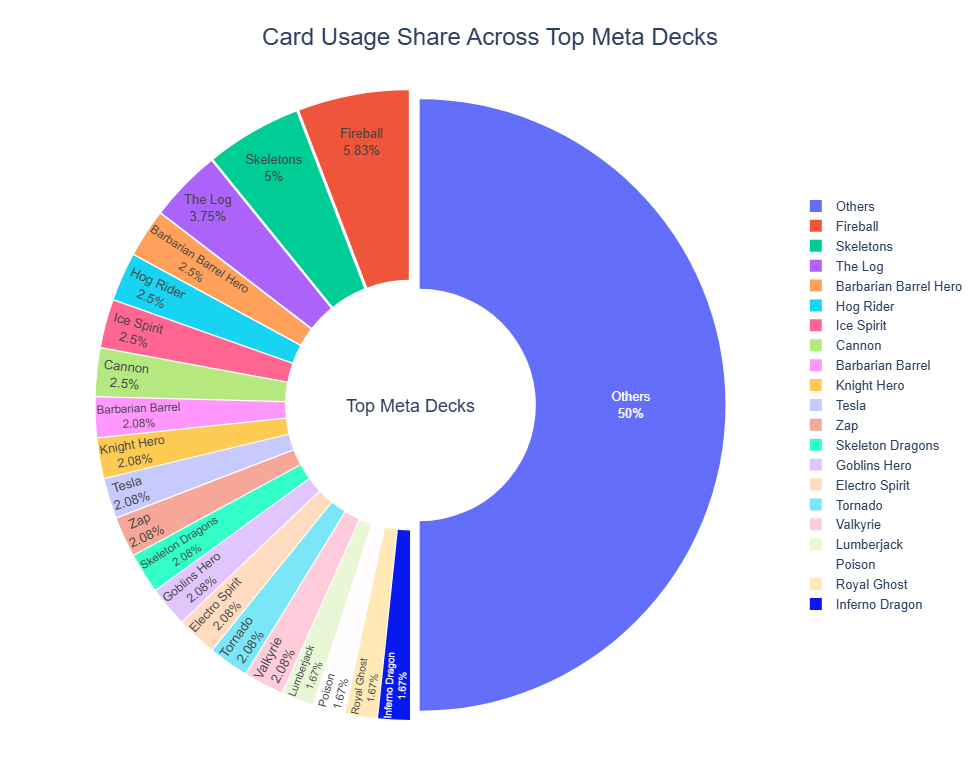
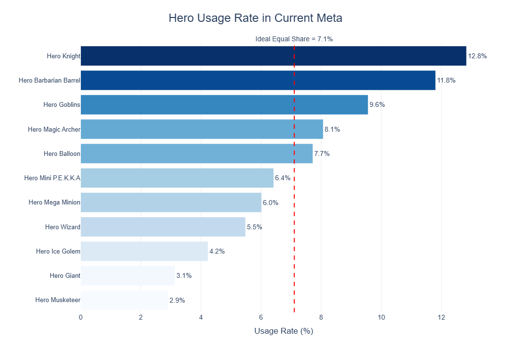
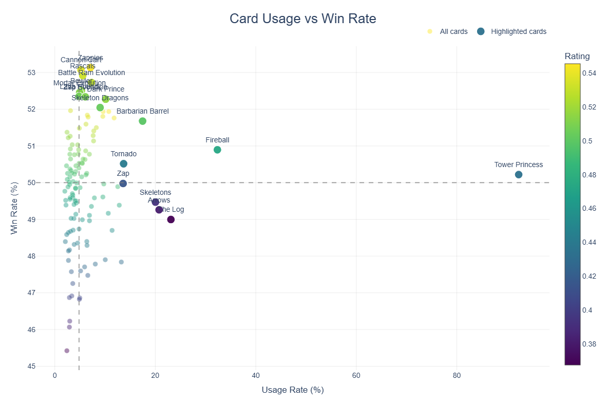

# Clash Royale Meta Analysis

### Data Analytics Project

The project analyzes public Clash Royale gameplay data to explore player behavior, game balance, and deck performance through data-driven insights. The workflow reflects practical data analyst skills relevant to game analytics environments.

## Tools Used

- Python
- Pandas
- NumPy
- SQL (SQLite)
- Plotly
- BeautifulSoup
- Jupyter Notebook

## Objective

- Analyze player preferences through card and deck usage trends
- Evaluate game balance using win rate and performance metrics
- Identify high-performing cards and popular deck archetypes
- Demonstrate how data can support better game design decisions

## Skills 

- Python for data cleaning, transformation, and analysis
- SQL for querying performance metrics and rankings
- Web scraping using BeautifulSoup
- Data visualization using Plotly
- Exploratory data analysis and insight generation
- Clear communication of findings for technical and non-technical audiences

## Key Analyses

### Card Performance Analysis
- Compared usage rate, win rate, and rating metrics across cards
- Investigated hero and evolution card performance
- Identified potential overperforming cards based on usage and win rate

### Deck Performance Analysis
- Analyzed top-ranked decks using win rate and usage metrics
- Compared average elixir cost to identify meta archetypes
- Explored deck composition patterns

### SQL Analytics Section
- Queried top-performing cards and decks
- Grouped performance by rarity and card type
- Demonstrated join operations and ranking logic
## Visual Highlights

### Card Usage Share Across Top Meta Decks
Shows how frequently cards appear across top-ranked meta decks, highlighting the most commonly used cards in competitive deck compositions.

---

### Heroes Usage Rate
Compares usage rates of hero cards to identify the most popular heroes in the current meta.

---

### Usage Rate vs Win Rate
Analyzes the relationship between card popularity and performance to identify efficient or overperforming cards.

## Why This Project Matters

Modern game teams rely on analytics to improve player experience, evaluate balance changes, and make informed product decisions. This project demonstrates an end-to-end analytics workflow using real public game data.

## Files

- `cr_meta_analysis.ipynb` — Main notebook with analysis, SQL queries, visualizations, and insights
- `royaleapi_popular.html` — Raw deck-level HTML source. 
- `cards_stat.html` — Raw card-level HTML source

## Data Source

Public Clash Royale deck and card statistics were collected from RoyaleAPI (https://royaleapi.com) and used for educational analysis project purposes. RoyaleAPI is an independent community resource for Clash Royale statistics and insights.
